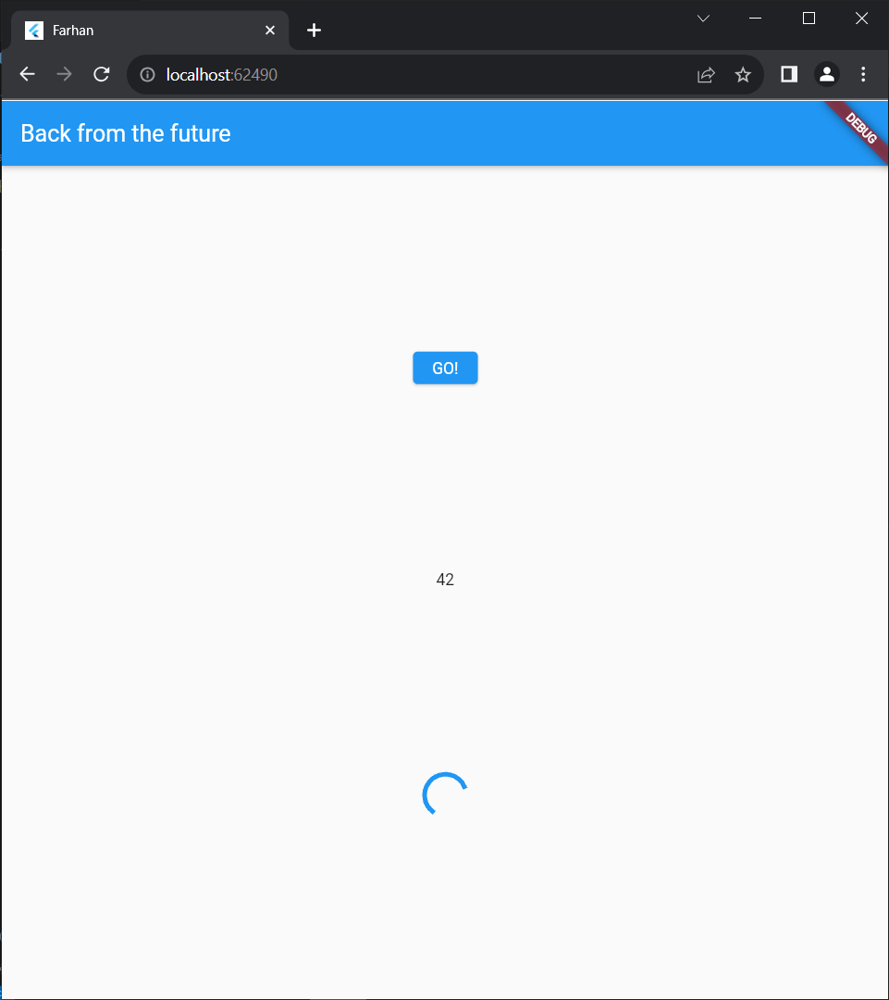
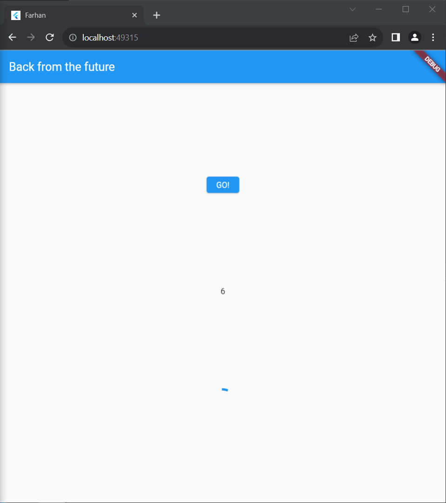
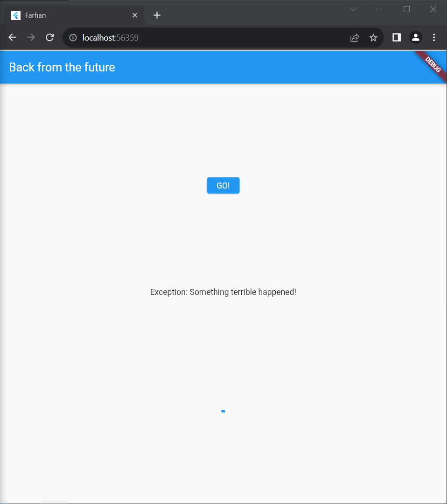
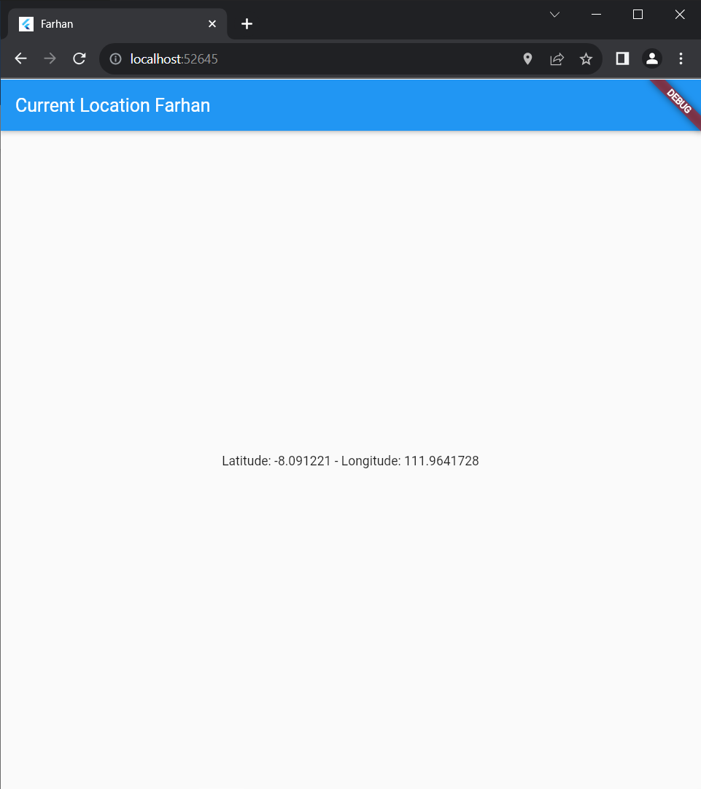

> **FARHAN DWI PRAMANA**
>
> 3H / 11
>
> 2141720125

---

# **Praktikum 1: Mengunduh Data dari Web Service (API)**

**Soal 1**
Tambahkan nama panggilan Anda pada title app sebagai identitas hasil pekerjaan Anda.

```
return Scaffold(
      appBar: AppBar(
        title: const Text('Back from the Future Farhan'),
      ),
```

**Soal 2** Carilah judul buku favorit Anda di Google Books, lalu ganti ID buku pada variabel `path`

```
Future<Response> getData() async {
    const authority = 'www.googleapis.com';
    const path = '/books/v1/volumes/dgyHjgEACAAJ';
    Uri url = Uri.https(authority, path);
    return http.get(url);
  }
```


**Soal 3** Jelaskan maksud kode langkah 5 tersebut terkait substring dan catchError!

```
            onPressed: () {
                setState(() {});
                getData()
                .then((value){
                  result = value.body.toString().substring(0,450);
                  setState(() {

                  });
                }).catchError((_){
                  result = 'An error has occured';
                  setState(() {

                  });
                });
              },
```

Pada langkah kelima, dilakukan penggunaan metode substring(0, 450) yaitu berguna untuk mengekstraksi karakter dengan panjang 450 pertama atau bisa dikatakan sabagai pembatas karakter. catchError digunakan sebagai menangkap atau mengatasi jika terjadi error ketika pemrosesan permintaan data.


# **Praktikum 2: Menggunakan await/async untuk menghindari callbacks**

**Soal 4** Jelaskan maksud kode langkah 1 dan 2

Langkah pertama menambahkan 3 metode di class \_FuturePageState yang digunakan untuk operasi asyncronous dengan masing-masing akan menunggu 3 detik yang menggunakan future.delayed yang kemudian akan mengembalikan nilai integer.

Pada langkah kedua, metode count() yang digunakan untuk operasi perhitungan dengan menunggu hasil dari beberapa operasi asynchronous dan kemudian melakukan sesuatu (dalam hal ini, mengupdate state widget) ketika semua operasi tersebut selesai.


# **Praktikum 3: Menggunakan Completer di Future**

**Langkah 2: Tambahkan variabel dan method**

**Soal 5** Jelaskan maksud kode langkah 2 tersebut!

Langkah 2 membuat variabel completer dan dua metode yaitu pertama metode getNumber() menginisialisasi Completer, memanggil metode calculate() yang menunda eksekusi selama 5 detik, dan mengembalikan completer future. Metode calculate() secara asinkron mengisi Completer dengan nilai 42 setelah penundaan, menciptakan alur eksekusi asinkron untuk mengakses nilai setelah operasi selesai.


**Soal 6**
Jelaskan maksud perbedaan kode langkah 2 dengan langkah 5-6
langkah 2 fokus pada pembuatan Completer dan menginisialisasi alur eksekusi asinkron dengan memanggil calculate().
langkah 5-6 fokus pada implementasi operasi yang memakan waktu dalam metode calculate(), dan menggunakan then serta catchError untuk menangani hasil atau kesalahan setelah pemanggilan getNumber().



# **Praktikum 4: Memanggil Future secara paralel**

**Soal 7**


**Soal8**
Jelaskan maksud perbedaan kode langkah 1 dan 4!
Langkah 1 menggunakan FutureGroup untuk menangani beberapa future sekaligus. Tiga fungsi asinkron ditambahkan ke grup, ditutup dengan futureGroup.close(). Metode then pada futureGroup.future mengumpulkan hasilnya, menjumlahkannya, dan memperbarui state widget.
Langkah 4 menggunakan Future.wait untuk mengeksekusi tiga fungsi asinkron secara bersamaan dan mengumpulkan hasilnya dalam satu future tunggal.

# **Praktikum 5: Menangani Respon Error pada Async Code**

**Soal 9**


**Soal 10**
Jelaskan perbedaan kode langkah 1 dan 4!
returnError() memicu kesalahan setelah menunggu selama 2 detik, sedangkan handleError() mencoba mengeksekusi returnError(), menangkap kesalahan jika ada, dan selalu menjalankan blok finally setelah operasi selesai.

# **Praktikum 6: Menggunakan Future dengan StatefulWidget**

**Soal 11**
Tambahkan nama panggilan Anda pada tiap properti title sebagai identitas pekerjaan Anda.

```
 @override
  Widget build(BuildContext context) {
    return  Scaffold(
      appBar: AppBar(
        title: Text('Current Location Farhan'),
      ),
      body: Center(
        child: Text(myPosition),
      ),
    );
  }
```

**Soal 12**
Apakah Anda mendapatkan koordinat GPS ketika run di browser? Mengapa demikian?
Bisa, karena saya menggunakan dependensi geolocator : ^10.1 yang akan secara otomatis menambahkan paket geolocator_web yang mendukung geolokasi di browser



# **Praktikum 7: Manajemen Future dengan FutureBuilder**

**Soal 13**
Soal 13 Apakah ada perbedaan UI dengan praktikum sebelumnya? Mengapa demikian?

Penggunaan FutureBuilder menyederhanakan dan membersihkan kode saat bekerja dengan operasi asinkron, meningkatkan keterbacaan dan mengurangi boilerplate. Ini juga menyediakan struktur yang terorganisir untuk menangani state dan kondisi UI.


**Soal 14**
Apakah ada perbedaan UI dengan langkah sebelumnya? Mengapa demikian?
Tidak ada perbedaanya


# **Praktikum 8: Navigation route dengan Future Function**

**Soal 15**
Tambahkan nama panggilan Anda pada tiap properti title sebagai identitas pekerjaan Anda.

```
Widget build(BuildContext context) {
    return Scaffold(
      backgroundColor: color,
      appBar: AppBar(
        title: const Text('Navigation First Screen Farhan'),
      ),
      body: Center(
        child: ElevatedButton(
            child: const Text('Change Color'),
            onPressed: () {
              _navigateAndGetColor(context);
            }),
      ),
    );
  }
```

**Soal 16**
Cobalah klik setiap button, apa yang terjadi ? Mengapa demikian ?
Akan merubah warna sesuai dengan buttonnya, jika klik button red maka background akan beruah menjadi merah, dan setertusnya.


# **Praktikum 9: Memanfaatkan async/await dengan Widget Dialog**

**Soal 17**
Cobalah klik setiap button, apa yang terjadi ? Mengapa demikian ?
Tombol "Change Color" di NavigationDialogScreen memunculkan dialog pemilihan warna. Namun, pembaruan warna latar belakang terkendala karena pemanggilan setState menggunakan nilai yang sama seperti sebelumnya. Untuk memperbaikinya, kita perlu menyimpan nilai warna yang dipilih dari dialog dan menggunakannya dalam setState agar pembaruan warna terjadi dengan benar setelah pemilihan warna.


