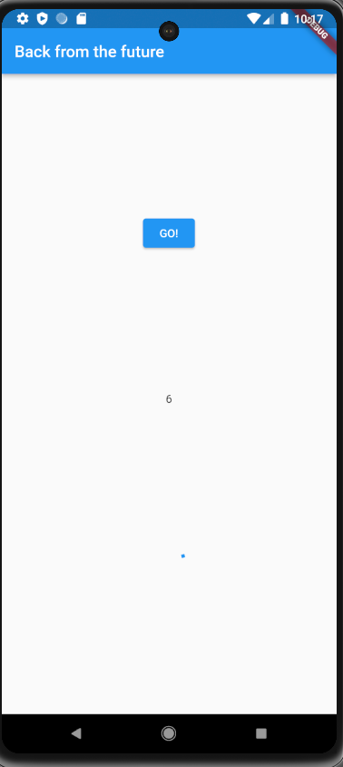
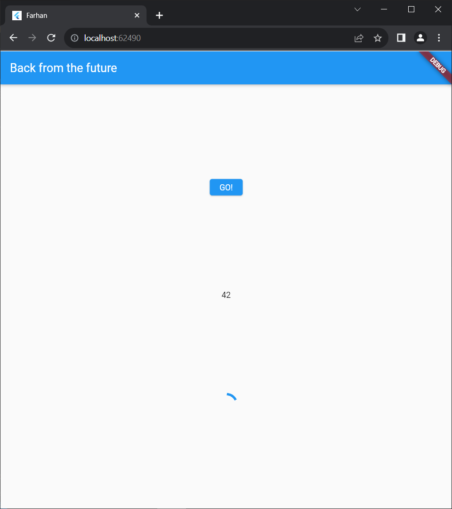

> **FARHAN DWI PRAMANA**
>
> 3H / 11
>
> 2141720125

---

# **Praktikum 1: Mengunduh Data dari Web Service (API)**

**Soal 1**
Tambahkan nama panggilan Anda pada title app sebagai identitas hasil pekerjaan Anda.

```
return Scaffold(
      appBar: AppBar(
        title: const Text('Back from the Future Farhan'),
      ),
```

**Soal 2** Carilah judul buku favorit Anda di Google Books, lalu ganti ID buku pada variabel `path`

```
Future<Response> getData() async {
    const authority = 'www.googleapis.com';
    const path = '/books/v1/volumes/dgyHjgEACAAJ';
    Uri url = Uri.https(authority, path);
    return http.get(url);
  }
```


**Soal 3** Jelaskan maksud kode langkah 5 tersebut terkait substring dan catchError!

```
            onPressed: () {
                setState(() {});
                getData()
                .then((value){
                  result = value.body.toString().substring(0,450);
                  setState(() {

                  });
                }).catchError((_){
                  result = 'An error has occured';
                  setState(() {

                  });
                });
              },
```

Pada langkah kelima, dilakukan penggunaan metode substring(0, 450) yaitu berguna untuk mengekstraksi karakter dengan panjang 450 pertama atau bisa dikatakan sabagai pembatas karakter. catchError digunakan sebagai menangkap atau mengatasi jika terjadi error ketika pemrosesan permintaan data.


# **Praktikum 2: Menggunakan await/async untuk menghindari callbacks**

**Soal 4** Jelaskan maksud kode langkah 1 dan 2

Langkah pertama menambahkan 3 metode di class \_FuturePageState yang digunakan untuk operasi asyncronous dengan masing-masing akan menunggu 3 detik yang menggunakan future.delayed yang kemudian akan mengembalikan nilai integer.

Pada langkah kedua, metode count() yang digunakan untuk operasi perhitungan dengan menunggu hasil dari beberapa operasi asynchronous dan kemudian melakukan sesuatu (dalam hal ini, mengupdate state widget) ketika semua operasi tersebut selesai.



# **Praktikum 3: Menggunakan Completer di Future**

**Langkah 2: Tambahkan variabel dan method**

**Soal 5** Jelaskan maksud kode langkah 2 tersebut!

Langkah 2 membuat variabel completer dan dua metode yaitu pertama metode getNumber() menginisialisasi Completer, memanggil metode calculate() yang menunda eksekusi selama 5 detik, dan mengembalikan completer future. Metode calculate() secara asinkron mengisi Completer dengan nilai 42 setelah penundaan, menciptakan alur eksekusi asinkron untuk mengakses nilai setelah operasi selesai.


